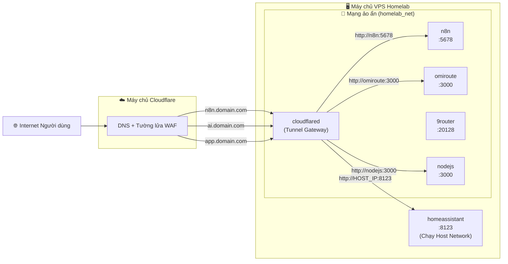

# 🏗️ Kế hoạch Triển khai Chi tiết: Homelab Server (Bản Modular / App Store)

## 🎯 Tổng quan
Kịch bản `homelab.sh` được thiết kế theo cấu trúc **Modular (App Store)** vô cùng linh hoạt.
Thay vì cài đặt nhồi nhét toàn bộ dịch vụ cùng lúc, hệ thống được chia thành 2 phần độc lập:
1. **Hệ thống lõi (Core)**: Trạm trung tâm chứa Docker và Cloudflare Tunnel (Proxy Gateway).
2. **Quản lý ứng dụng (App Store)**: Cho phép cài đặt riêng lẻ từng ứng dụng (N8N, Home Assistant, OmniRoute, 9Router, NodeJS...) theo nhu cầu tùy thích của bạn.

---

## 📂 1. Kiến trúc Thư mục trên VPS

> [!TIP]
> Việc gom nhóm toàn bộ dữ liệu hệ thống vào một thư mục gốc `/opt/homelab` giúp cho việc bảo trì, di chuyển server (migrate) hoặc backup trở nên cực kỳ gọn gàng chỉ bằng một câu lệnh nén file duy nhất!

```text
/opt/homelab/                          # Thư mục gốc chứa mọi thứ
├── .homelab_config                    # File cấu hình ẩn lưu trữ Tên miền, CF_TOKEN...
├── .backup_key                        # 🔑 Chìa khóa mã hóa AES-256 chống trộm data
│
├── cloudflared/
│   └── docker-compose.yml             # Container Cloudflare Tunnel (Đào hầm mạng)
│
├── n8n/
│   ├── docker-compose.yml
│   └── data/                          # 📦 Dữ liệu N8N
│
├── homeassistant/
│   ├── docker-compose.yml
│   └── config/                        # 📦 Cấu hình HA (Chạy host network)
│
├── omiroute/
│   ├── docker-compose.yml
│   └── data/                          # 📦 Dữ liệu OmniRoute (AI Gateway)
│
├── openclaw/
│   ├── docker-compose.yml
│   └── workspace/                     # 📦 Dữ liệu OpenClaw (AI Chat)
│
├── 9router/
│   ├── docker-compose.yml
│   └── data/                          # 📦 Dữ liệu 9Router (Trạm AI)
│
└── nodejs/
    ├── docker-compose.yml
    └── app/                           # 📦 Source code ứng dụng NodeJS của bạn
```

*(Thư mục chứa các tệp tin Sao lưu mã hóa: `/opt/homelab_backups/`)*

---

## 🗺️ 2. Sơ đồ Định tuyến (Routing qua Cloudflare Tunnel)

Chúng ta **không sử dụng Nginx hay OpenLiteSpeed** làm proxy hay mở port trực tiếp lên mạng. 
Thay vào đó, **Cloudflare Tunnel** sẽ làm nhiệm vụ tạo một đường hầm riêng tư bảo mật tuyệt đối kết nối trực tiếp các container nội bộ ra thế giới bên ngoài.



> [!NOTE]
> **Giải thích cơ chế bảo mật:** Cả N8N, OmniRoute, và NodeJS đều chạy trong mạng cô lập `homelab_net`. Dữ liệu sẽ đi từ Trình duyệt -> Cloudflare -> Cloudflare Tunnel (VPS) -> Thẳng tới Container. Mọi kết nối đều bỏ qua hoàn toàn Port 80/443 của máy chủ gốc, khiến Hacker dù quét dò cổng (Port Scan) VPS cũng không thể tìm ra lỗ hổng nào!

---

## 🔄 3. Luồng Hoạt động của Script (Workflow)

### 📋 Menu Chính (Main Menu)
1. 🚀 **Quản lý Docker**: Cài đặt lõi Docker (Tự động nhận diện Ubuntu/Debian/CentOS/WSL). Chức năng bắt buộc phải chạy trước khi tải App.
2. 🌐 **Cấu hình Cloudflare Tunnel**: Liên kết kịch bản với hệ sinh thái Zero-Trust bằng Token an toàn.
3. 🛒 **App Store (Kho ứng dụng)**: Siêu thị cài đặt lẻ tẻ từng ứng dụng, tích hợp "Tiện ích mở rộng" (Xem/đổi mật khẩu an toàn, fix lỗi quyền).
4. 🔄 **Bật/Tắt toàn bộ dịch vụ**: Phanh khẩn cấp để Start/Stop hàng loạt tất cả các container.
5. ⚙️ **Trạng thái hệ thống**: Giám sát RAM, dung lượng Ổ cứng, Uptime.
6. 💾 **Sao lưu & Phục hồi**: Tính năng nén đóng gói an toàn và mã hóa quân sự (`AES-256`) toàn bộ hệ thống.
7. 🧹 **Dọn dẹp rác hệ thống**: Quét dọn các container ẩn, image thừa để giải phóng dung lượng.
8. 📊 **Phân tích dung lượng ổ cứng**: Bộ công cụ "thám tử" soi chiếu thư mục và image nào đang ăn mòn ổ đĩa của bạn nhất.

### ⚙️ Luồng Cài đặt tự động một Ứng dụng (Ví dụ: NodeJS)
1. 🖱️ Người dùng vào `Menu 3` -> Bấm Phím `6` (Cài NodeJS).
2. 🔍 Kịch bản quét hệ thống: *Đã có lệnh `docker` chưa?* (Nếu chưa -> văng lỗi đỏ, bắt quay lại Menu 1).
3. 💬 Đặt câu hỏi tạo Profile mạng: `Nhập Subdomain dự kiến cho nodejs (VD: app.yourdomain.com):`
4. 🏗️ Sinh tự động cấu trúc hầm trú ẩn (thư mục `/opt/homelab/nodejs/`) và bơm file `docker-compose.yml`.
5. ⬇️ Kéo image và kích nổ `docker compose up -d` âm thầm.
6. 📝 In ra màn hình hướng dẫn từng bước chi tiết cách người dùng lên trang Cloudflare trỏ Public Hostname vào URL ảo `http://nodejs:3000`.

---

## 🛡️ 4. Cơ chế Sao lưu (Backup) An Toàn

> [!CAUTION]
> Quá trình sao lưu dữ liệu sống của Database SQLite (như N8N hay Home Assistant) rất dễ gây hỏng dữ liệu nếu chúng ta cố nén file trong lúc app đang ghi dữ liệu. Do đó script sử dụng một quy trình khép kín và an toàn tuyệt đối.

1. 🛑 Tạm dừng (Stop) tất cả các container trên toàn hệ thống trong vài giây.
2. 📦 Đóng gói (`.tar.gz`) toàn bộ thư mục `/opt/homelab` *(bỏ qua file chìa khóa mã hóa)*.
3. 🔐 Kích hoạt bộ xử lý OpenSSL, mã hóa file bằng chuẩn quân sự **AES-256** với chìa khóa ngẫu nhiên (chỉ sinh ra 1 lần duy nhất và nằm ẩn ở `.backup_key`).
4. ▶️ Bật lại (Start) toàn bộ container.
5. 🧹 Dọn dẹp quét rác, tự động xóa các bản backup cũ để giải phóng ổ cứng (chỉ giữ lại giới hạn 10 bản mới nhất).

---

## 📈 5. Tiềm năng Mở rộng trong tương lai
Nhờ vào tính chất cấu trúc Modular (Ráp khối Lego), việc thêm bất cứ ứng dụng mới nào (WordPress, MySQL, Redis...) sau này cho Homelab là vô cùng dễ dàng. Chỉ cần ném một hàm `install_app` mới vào trong đoạn mã nguồn của Menu App Store là hệ sinh thái của bạn lại vươn xa thêm một bước!
